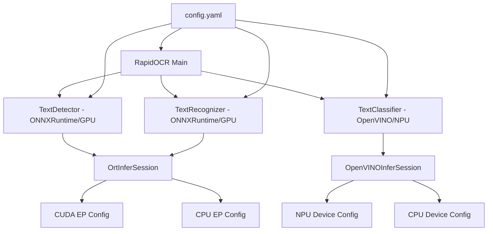
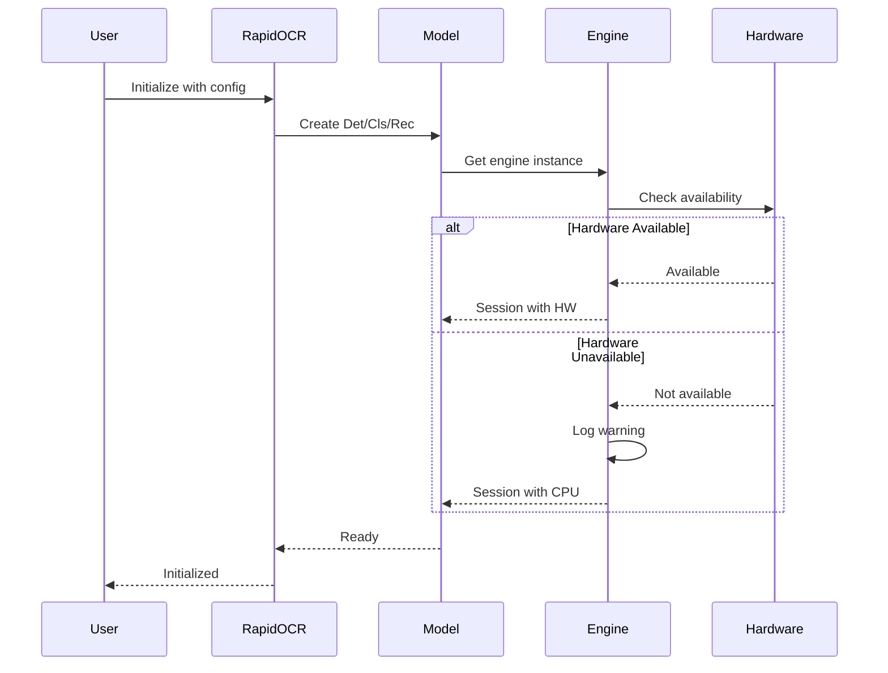

# Design Document

## Overview

This design document outlines the architecture and implementation approach for adding NPU support to classification models via OpenVINO and GPU support to detection/recognition models via ONNXRuntime in the RapidOCR system. The design maintains backward compatibility while introducing new hardware acceleration capabilities and creates a custom wheel package named "rapidocr_hkmc".

### Key Design Principles

1. **Separation of Concerns**: Each model type (cls, det, rec) can independently configure its inference engine and hardware target
2. **Graceful Degradation**: System falls back to CPU when requested hardware is unavailable
3. **Configuration-Driven**: All hardware acceleration settings are controlled through the existing YAML configuration system
4. **Minimal API Changes**: Existing code using RapidOCR continues to work without modifications
5. **Explicit Hardware Selection**: Users explicitly configure which hardware to use for each model type

## Architecture

### High-Level Component Diagram



### Configuration Flow



## Components and Interfaces

### 1. Configuration Schema Updates

**File**: `rapidocr/config.yaml`

The configuration file will be extended to support NPU device selection for OpenVINO and maintain existing GPU configuration for ONNXRuntime.

```yaml
EngineConfig:
    onnxruntime:
        # Existing configuration maintained
        use_cuda: true  # Enable for GPU on det/rec models
        cuda_ep_cfg:
            device_id: 0
            arena_extend_strategy: "kNextPowerOfTwo"
            cudnn_conv_algo_search: "EXHAUSTIVE"
            do_copy_in_default_stream: true
    
    openvino:
        # Extended configuration for NPU support
        device_name: "NPU"  # Options: "CPU", "NPU", "GPU"
        inference_num_threads: -1
        performance_hint: "LATENCY"  # Options: "LATENCY", "THROUGHPUT", "CUMULATIVE_THROUGHPUT"
        # ... existing parameters

Cls:
    engine_type: "openvino"  # Use OpenVINO for NPU
    # ... existing parameters

Det:
    engine_type: "onnxruntime"  # Use ONNXRuntime for GPU
    # ... existing parameters

Rec:
    engine_type: "onnxruntime"  # Use ONNXRuntime for GPU
    # ... existing parameters
```

### 2. OpenVINO Engine Enhancement

**File**: `rapidocr/inference_engine/openvino.py`

**Current State**: OpenVINO engine only supports CPU device with configuration options for threading and performance.

**Design Changes**:

1. Add `device_name` parameter support to allow NPU, GPU, or CPU selection
2. Implement device availability checking before compilation
3. Add fallback logic to CPU when requested device is unavailable
4. Enhance configuration validation for device-specific settings

**Key Methods**:

```python
class OpenVINOInferSession(InferSession):
    def __init__(self, cfg: DictConfig):
        # Initialize OpenVINO Core
        # Extract device_name from config (default: "CPU")
        # Check device availability
        # Configure device-specific properties
        # Compile model for target device
        # Log actual device being used
    
    def _get_target_device(self, cfg: DictConfig) -> str:
        # Extract device_name from engine_cfg
        # Validate device name
        # Return device string
    
    def _check_device_availability(self, core: Core, device: str) -> bool:
        # Query available devices from core
        # Check if requested device is available
        # Return availability status
    
    def _init_config(self, cfg: DictConfig, device: str) -> Dict[Any, Any]:
        # Build device-specific configuration
        # Apply performance hints
        # Return config dictionary
```

**Device Selection Logic**:
- If `device_name` is "NPU" and NPU is available → use NPU
- If `device_name` is "NPU" and NPU is unavailable → log warning, use CPU
- If `device_name` is "CPU" → use CPU
- If `device_name` is not specified → use CPU (backward compatible)

### 3. ONNXRuntime Engine Verification

**File**: `rapidocr/inference_engine/onnxruntime/main.py`

**Current State**: ONNXRuntime engine already supports CUDA through `use_cuda` flag and provider configuration.

**Design Changes**: No structural changes needed. The existing implementation already supports:
- CUDA execution provider configuration
- Device ID selection
- Memory management settings
- Fallback to CPU when CUDA unavailable

**Verification Points**:
1. Ensure `use_cuda: true` in config enables GPU for det/rec models
2. Verify CUDA EP configuration parameters are properly passed
3. Confirm fallback behavior works correctly

### 4. Package Configuration

**File**: `setup.py`

**Design Changes**:

1. Change `MODULE_NAME` from "rapidocr" to "rapidocr_hkmc"
2. Update package metadata to reflect custom build
3. Ensure all dependencies are correctly specified
4. Maintain entry point compatibility

**Key Changes**:

```python
MODULE_NAME = "rapidocr_hkmc"

setuptools.setup(
    name=MODULE_NAME,
    version=VERSION_NUM,
    description="Awesome OCR Library with NPU/GPU Support",
    # ... other metadata
    install_requires=read_txt("requirements.txt"),
    package_dir={"": MODULE_NAME},  # Updated to new name
    packages=setuptools.find_namespace_packages(where=MODULE_NAME),
    entry_points={
        "console_scripts": [f"{MODULE_NAME}={MODULE_NAME}.main:main"],
    },
)
```

**Package Structure**:
```
rapidocr_hkmc/
├── __init__.py
├── main.py
├── config.yaml
├── inference_engine/
│   ├── openvino.py (modified)
│   ├── onnxruntime/
│   └── ...
├── ch_ppocr_cls/
├── ch_ppocr_det/
├── ch_ppocr_rec/
└── ...
```

### 5. Module Renaming Strategy

**Approach**: Create a new package structure with renamed module while maintaining code compatibility.

**Steps**:
1. Copy entire `rapidocr/` directory to `rapidocr_hkmc/`
2. Update internal imports if needed (most imports are relative, so minimal changes)
3. Update `setup.py` to point to new directory
4. Ensure `__init__.py` exports maintain same API

**Import Compatibility**:
```python
# Old import (original package)
from rapidocr import RapidOCR

# New import (custom package)
from rapidocr_hkmc import RapidOCR

# API remains identical
ocr = RapidOCR()
result = ocr(image)
```

## Data Models

### Configuration Data Structure

```python
@dataclass
class OpenVINOConfig:
    device_name: str = "CPU"  # "CPU", "NPU", "GPU"
    inference_num_threads: int = -1
    performance_hint: Optional[str] = None  # "LATENCY", "THROUGHPUT", etc.
    performance_num_requests: int = -1
    enable_cpu_pinning: Optional[bool] = None
    num_streams: int = -1
    enable_hyper_threading: Optional[bool] = None
    scheduling_core_type: Optional[str] = None

@dataclass
class ONNXRuntimeConfig:
    intra_op_num_threads: int = -1
    inter_op_num_threads: int = -1
    enable_cpu_mem_arena: bool = False
    use_cuda: bool = False
    cuda_ep_cfg: Dict[str, Any] = None
    # ... other existing fields
```

### Engine Session Interface

```python
class InferSession(abc.ABC):
    @abc.abstractmethod
    def __init__(self, config):
        """Initialize inference session with configuration"""
        pass
    
    @abc.abstractmethod
    def __call__(self, input_content: np.ndarray) -> np.ndarray:
        """Run inference on input data"""
        pass
    
    @abc.abstractmethod
    def have_key(self, key: str = "character") -> bool:
        """Check if model has specific metadata key"""
        pass
```

## Error Handling

### Error Categories

1. **Configuration Errors**
   - Invalid device name
   - Incompatible engine settings
   - Missing required parameters

2. **Hardware Availability Errors**
   - NPU not available when requested
   - GPU/CUDA not available when requested
   - Insufficient device memory

3. **Runtime Errors**
   - Model loading failures
   - Inference execution errors
   - Memory allocation failures

### Error Handling Strategy

```python
class HardwareAccelerationError(Exception):
    """Base exception for hardware acceleration issues"""
    pass

class DeviceNotAvailableError(HardwareAccelerationError):
    """Raised when requested device is not available"""
    pass

class ConfigurationError(HardwareAccelerationError):
    """Raised when configuration is invalid"""
    pass
```

**Handling Approach**:
1. **Configuration Errors**: Raise exception immediately with clear message
2. **Hardware Unavailability**: Log warning, fall back to CPU, continue execution
3. **Runtime Errors**: Raise exception with diagnostic information

### Logging Strategy

```python
# Device selection
logger.info(f"Requested device: {device_name}")
logger.info(f"Available devices: {available_devices}")
logger.info(f"Using device: {actual_device}")

# Fallback scenarios
logger.warning(f"NPU not available, falling back to CPU")
logger.warning(f"CUDA not available, falling back to CPU")

# Configuration
logger.debug(f"OpenVINO config: {config}")
logger.debug(f"ONNXRuntime providers: {providers}")
```

## Testing Strategy

### Unit Tests

1. **OpenVINO Engine Tests**
   - Test NPU device selection when available
   - Test fallback to CPU when NPU unavailable
   - Test configuration validation
   - Test device availability checking

2. **ONNXRuntime Engine Tests**
   - Test CUDA provider configuration
   - Test GPU device selection
   - Test fallback to CPU when CUDA unavailable
   - Verify existing tests still pass

3. **Configuration Tests**
   - Test YAML parsing with new parameters
   - Test configuration validation
   - Test backward compatibility with old configs

### Integration Tests

1. **End-to-End OCR Tests**
   - Test cls model with OpenVINO/NPU
   - Test det model with ONNXRuntime/GPU
   - Test rec model with ONNXRuntime/GPU
   - Test mixed configuration (different engines per model)

2. **Package Tests**
   - Test wheel package builds successfully
   - Test installation from wheel
   - Test import as `rapidocr_hkmc`
   - Test API compatibility

### Hardware-Specific Tests

1. **NPU Tests** (when NPU available)
   - Verify cls model runs on NPU
   - Compare accuracy with CPU baseline
   - Measure performance improvement

2. **GPU Tests** (when CUDA available)
   - Verify det/rec models run on GPU
   - Compare accuracy with CPU baseline
   - Measure performance improvement

### Test Environment Requirements

- Python 3.6+
- OpenVINO with NPU support (for NPU tests)
- CUDA-enabled GPU and onnxruntime-gpu (for GPU tests)
- Test images and expected outputs

## Implementation Considerations

### Backward Compatibility

1. **Default Behavior**: If no device configuration is specified, system uses CPU (existing behavior)
2. **Configuration Files**: Old configuration files without NPU/GPU settings continue to work
3. **API**: No changes to public API; existing code works without modification
4. **Import Paths**: New package name, but same API structure

### Performance Optimization

1. **Model Loading**: Cache compiled models to avoid recompilation
2. **Batch Processing**: Leverage existing batch processing for cls and rec models
3. **Memory Management**: Use device-specific memory allocation strategies
4. **Thread Configuration**: Optimize thread counts based on device type

### Dependencies

**Required**:
- `openvino>=2023.0.0` (for NPU support)
- `onnxruntime>=1.12.0` or `onnxruntime-gpu>=1.12.0` (for GPU support)
- Existing dependencies (opencv, numpy, etc.)

**Optional**:
- `onnxruntime-gpu` (for CUDA support)
- Intel NPU drivers (for NPU support)

### Platform Considerations

1. **Windows**: Full support for NPU (Intel) and GPU (NVIDIA/AMD)
2. **Linux**: Full support for NPU and GPU
3. **macOS**: CPU and GPU support (no NPU)

## Migration Path

### For Existing Users

1. **No Changes Required**: Existing installations continue to work with CPU
2. **Opt-In Acceleration**: Users modify config.yaml to enable NPU/GPU
3. **Gradual Migration**: Can enable acceleration for one model type at a time

### For New Installations

1. Install `rapidocr_hkmc` wheel package
2. Configure desired hardware acceleration in config.yaml
3. Verify hardware availability through logs
4. Run OCR with accelerated inference

## Security Considerations

1. **Model Files**: Verify model file integrity using SHA256 checksums
2. **Configuration**: Validate all configuration inputs to prevent injection
3. **Dependencies**: Pin dependency versions to avoid supply chain attacks
4. **File Paths**: Sanitize file paths to prevent directory traversal

## Future Enhancements

1. **Auto-Detection**: Automatically detect and use best available hardware
2. **Dynamic Switching**: Switch between devices based on workload
3. **Multi-Device**: Distribute models across multiple devices
4. **Quantization**: Support INT8 quantization for NPU
5. **Benchmarking**: Built-in performance benchmarking tools
